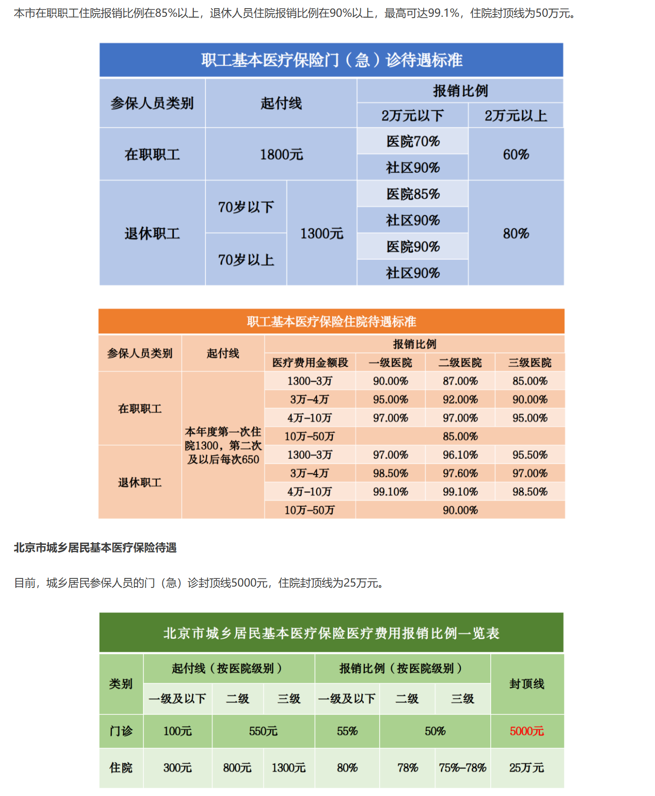

# 01-医保的使用

## 医保的分类

- 基础医保主要分为3大类：公费医疗、职工医保和城乡居民医保；
- 公费医疗：一般是公务员、事业单位等职员，无起付点，报销类型多，比例高；
- 职工医保：普通公司都会缴纳，分为个人账户和基金账户，存在起付点，报销比例一般；
- 城乡居民医保：报销比例低，价格便宜，一般是个人按年缴纳；

## 职工医保的报销

> 此内容主要针对于北京职工医保；

- 医保报销的前提就是在就医时使用医保挂号；
- 挂号费不需要到达起付点，直接单次报销40元；比如三家医院主治医师挂号费50元，个人需要自付10元，而主任医师挂号100元，个人需要付60元；
-　各个地区的起付线不同，报销比例不同，每年可能也会调整，建议查询当地政府网页获得最新的信息；以下为北京2024年的待遇，门诊一般相较于住院会报销比例低一些；
- ；
- 在满足报销起付线后，每次使用医保卡付款时，会直接报销掉医保覆盖的那部分，只需要付自己需要支付的那一部分；

## 关于报销项目

- 一般医疗项目会分为：自付一、自付二和自费；
- 简单来说就是在自付一的项目才是医保报销的项目，其他两个项目里的金额是不参与医保报销的；
- 大部分常规检查、手术和药物都在自付一中，一些进口药会属于自付二和自费，还有一些项目更加极端，不可以使用医保结算；
- 当想了解具体某一项目的报销情况，可以通过搜xxx是自付一嘛来了解具体情况；

## 个人账户和基金账户

- 基金账户无需太理解详情，直接可以看作是医保报销的那部分钱即可；
- 个人账户：只有职工医保的个人账户里是有钱的，每个月交的医保里，具体金额取决于每月交的金额；在看病时，除去医保报销的不分，还需要支付一笔钱，这笔钱可以扣个人账户里的钱；
  - 个人账户在看病时，可以等同于现金，所以完全没有必要把医保个人账户的钱通过别的方式提取出来；
- 其他支付手段：在个人账户中金额不足时，就需要使用自己的现金支付剩余的钱了；

## 其他保险（补充医疗）

- 医保的报销还是十分有限的，对于大病来说能够让其不掏空普通家庭，但对于一些病，覆盖的还不够好；
- 这种时候，一些公司会购买一些医疗保险作为补充医疗的福利，也因不同保险而报销比例不同，但多能覆盖自付一的一部分，这种的报销则需要基于特定的公司规定来报销；